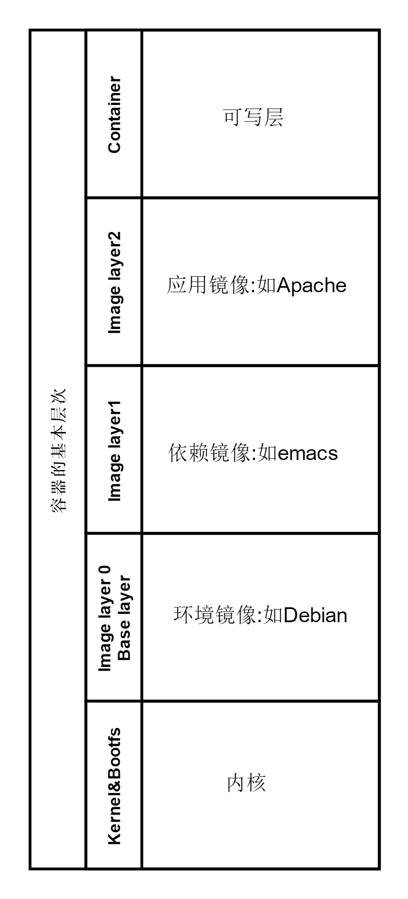
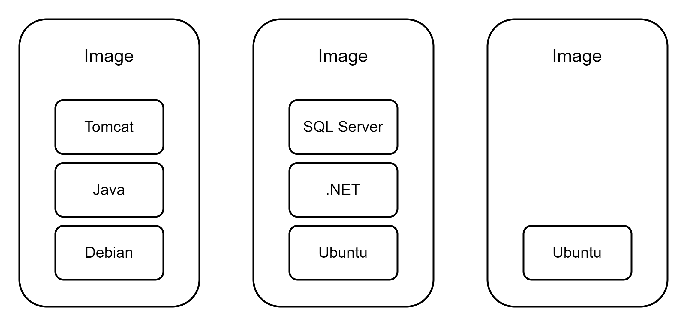
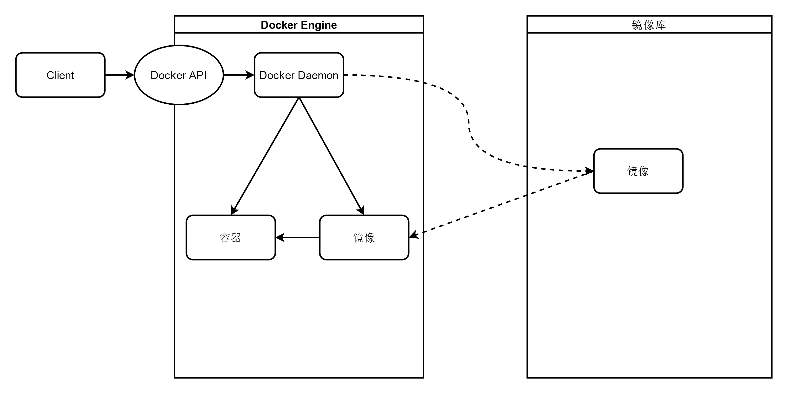

# 🕹 容器架构

## 容器化技术的沿革发展

虚拟化容器技术最早可以追溯到上世纪70年代末。随着硬件的发展和需求的变化，容器化技术和思想也在不断演进和革新。

### chroot：最早的容器化思想

chroot最早出现在Unix V7中。当时的系统开发十分复杂，因此急需一个**高效稳定可重建**的测试环境，因为程序编译调试之后，测试环境就被“污染”了，下一次构建测试需要重新安装和配置环境。而以当时的计算资源，不断新建和销毁测试环境十分困难。

于是chroot应运而生。该功能为每个进程提供一个独立的磁盘空间，将一个进程及其子进程的根目录改变到文件系统中的新位置，让这些进程只能访问到该目录。这可以粗略理解为将机器的根目录切换到当前目录上（所以叫chroot）。这项技术被称为 Chroot Jail。这是最早的进程隔离技术，可以通过切换根目录等方法限制进程的文件访问权限。

### FreeBSD Jails

2000年发布的FreeBSD系统附带了FreeBSD Jail组件作为系统管理员用来增强FreeBSD系统安全性的工具。该组件扩展了chroot的概念和作用范围，创建了一个独立于系统其余部分的安全环境。在jail内的应用程序不能访问外部的文件资源，从而实现了隔离，破坏在jail中运行的服务不会损害整个系统。Jails 通过虚拟化对文件系统、用户和网络子系统的访问，改进了chroot技术。

### LinuxVServer的隔离机制

Linux VServer于2001年发布，并且使用了和FreeBSD Jail一致的技术，可以对计算机系统上的物理资源和系统资源，比如文件系统，网络地址，内存等进行分区。这种分区就称为安全上下文。安全上下文中的虚拟操作系统叫做虚拟私有服务器，即VPS。

### Process Containers和CGroup

Process Containers由 Google 在 2006 年推出，用于管理和限制隔离环境下资源的使用。2007年，为了避免和Linux内核中的Container混淆，改名为Control Groups并且合并到Linux的2.6.24版本内核中。

### Docker

2013年发布的Docker是容器技术的一次革命性飞跃。Docker最初由dotCloud公司开发并维护，于2013年3月以Apache协议开源并在Github上维护。

Docker开源后受到了广泛的关注和讨论， 越来越多的互联网企业开始向其贡献代码并参与修补。包括Google在内的一系列互联网厂家都将Docker整合进自己的产品。

Docker最初是基于Ubuntu 12.04LTS，并使用新兴的go语言实现的。Docker基于上文提到的cgroup和namespace技术对进程进行封装和资源隔离，属于操作系统层面的虚拟化技术。底层部分起初是基于LXC实现的，0.7版本以后开始移除LXC转而使用libcontainer。从1.11开始则使用runC和containerd作为底层驱动。

Docker是容器技术的一次飞跃，通过对容器进一步的封装和文件系统、网络资源等的虚拟化，极大地简化了容器的新建、部署、管理、维护和销毁。从此容器技术被更加广泛地使用，并且比虚拟机技术拥有更加优越的性能。

### Windows Containers

2015年，微软在Windows Server 2015上添加了基于该系统的容器支持，称为Windows Containers。该应用使得Docker可以在Windows Server上原生运行，而不需要启动一个Linux虚拟机来运行Docker。

### Kubernetes

Kubernetes是目前最流行的容器编排软件之一。最初是Google的内部项目。在经过用Go语言重写并且优化后，被正式命名为Kubernetes并于2014年开源。该应用致力于高效便捷地管理数以万计的物理机器。由于Google的业界声望，该应用开源之初就人气颇高，大量互联网厂家都加入了社区贡献者的行列。在经历两年多的市场争夺后，Kubernetes 凭借各厂商全力支持以及 77%的市场份额获得全面胜利，成为容器编排领域的事实标准。

## 容器引擎的基本层次结构-以Docker为例

上一章提到了Docker的发布掀起了新一轮容器技术的革新。毫无疑问，Docker作为一项划时代的技术，其思想和结构是非常典型的。要了解容器技术，就不能不提到Docker的层次结构。

### Docker的思想

* 集装箱化：Docker可以看作一个代码集装箱装卸工，那么容器就是一个个集装箱，里面包含了运行所需的一切环境和程序。
* 标准化：Docker的标准化保证了容器可以在任何不同的环境下稳定运行。Docker定义了三个标准化：运输方式、存储方式和接口。
  * 存储方式：容器的打包方法和文件格式是标准化的。Docker提供了可将任何代码封装为标准化格式容器的工具。
  * 运输方式：Docker的代码库提供了标准化的传输方式，在任何平台上都可以使用标准化工具从远程镜像库拉取镜像，并且可以保证一致性。
  * 接口：所有的软件开发工具、集成工具、部署脚本等相关工具和技术都应按照Docker的接口标准进行统一。
* 隔离化：每个容器是管理的最小单位，也是一个个独立的单元。容器之间可以做到互不影响。即使容器之间的环境依赖并不同，也不影响这些容器都可以在同一台物理机器上运行。同时，Docker的隔离性还可以保证如果一台容器出现运行问题，不会影响到其他运行的容器，也不会影响到物理机的运行。

### 什么是Docker引擎

**Docker 引擎是用于运行和管理容器的核心软件，用于部署、运行、管理容器**。为了响应开放容器计划标准（OCI）的要求，Docker引擎采用模块化的设计思想，其组件都可以替换。因此Docker引擎是模块化的。

### Docker引擎的组成

Docker 是典型的客户端-服务器架构，由如下主要的组件构成：Docker 客户端（Docker Client）、Docker 守护进程（Docker daemon）、containerd 以及 runc。它们分层次共同负责容器的创建和运行。

* Docker客户端（Docker CLI）：用户和容器引擎交互的载体，用于接收和处理输入的命令或者脚本，可以理解为Windows的cmd、webshell或者Liunx的Bash。
* API：命令解析完成后，Docker客户端调用相关的API，由API和引擎内部进行交互。
* 守护进程（daemon）：守护进程一直运行在后台，监听API发出的请求并管理容器、镜像等对象。守护进程还可以与其他守护进程通信，以管理跨物理机的Docker服务。
* 运行时（Runtime）和RunC：运行时是程序运行的地方，是Docker引擎的最底层。因此运行时程序需要结合系统内核为容器的运行和调度提供环境。RunC是目前Docker选用的运行时程序。
* containerd：一种符合OCI标准的容器运行时实现。其主要功能有：管理容器的生命周期、拉取/推送容器镜像、管理镜像及容器数据的存储、与runc等容器运行时交互和管理容器网络接口及网络等。相比于RunC，containerd是层次比较高的容器运行时。

### Docker的三大运行概念

#### 镜像

一般的操作系统包含系统内核和文件系统，而文件系统会在内核加载完毕后挂载root根目录等。类似地，镜像也是在容器环境（运行时）准备好后加载，因此可以视作一个特殊的文件系统。除了提供容器运行时所需的程序、库、资源、配置等文件外，镜像还包含了一些配置参数（如匿名卷、环境变量、用户等）。

镜像是轻量化的、可执行的软件包，其中包含了软件运行所需的所有内容：代码、二进制文件、运行时环境配置和要求、以及一些必要的系统库。容器化的应用程序具有稳定性，可以在任何平台、任何环境中稳定一致地运行；并且，容器化技术给了软件独立运行的可能，使得具有冲突的依赖的软件可以在同一台物理机上运行。

基于标准化存储的思想，镜像支持分层构建：镜像构建时，会从下到上一层层构建，前一层是后一层的基础。每一层构建完就不会再发生改变，并且修改仅限同一层，不会发生跨层修改。这种思想使得构建镜像更加容易：可以使用现有的镜像开始构建，只需要添加新的层就可以创建一个新镜像；但同时也要注意，由于镜像的修改仅限当前一层，因此对下一层镜像的操作并不会真的实现，只是在当前层被标记为“修改”。所以被删除的文件也会一直伴随着镜像。因此在构建镜像时应该谨慎操作，每一层只添加必须的组件。

通俗地说，镜像就像一个包裹。包裹可以装各种物品，镜像可以装各种应用（比如一个Tom cat或者apache、SQL Server）和环境（比如Ubuntu）。

#### 容器

从容器和镜像的关系层面讲，容器和镜像可以类比为实例和类。即容器是镜像的实例化，容器可以被创建、启动、运行、停止或删除，而镜像是无状态的，是不变的，除非对镜像文件执行修改和重新构建。

容器实际上是一种进程，但和一般的进程不同，容器有自己的命名空间（namespace），目的是完善隔离性和避免容器间的冲突。

和镜像类似，容器也有分层存储的机制。其中的存储层的生命周期和容器进程相同。进程销毁时，存储层的信息也会消失。因此如果要实现数据的持久化存储，应该使用容器的挂载卷（Volume）机制。

#### 仓库

仓库是一种对于镜像的集中存储、分发服务。用户可以在一处上传镜像，在任何地方拉去镜像。通常为了保证镜像的迭代和持续交付，一个仓库会包含一个镜像的所有可用历史版本；而这些版本以tag区别。默认地，如果不指定tag，则拉去最新版本的镜像。Docker最常用的仓库是DockerHub，而Github也有类似的功能。

### Docker的基本创建流程

Docker新建容器的基本流程如下：

1. 用户或者脚本通过Client输入指令。
2. Client解析指令并将解析后的请求传给API。
3. Deamon持续监听API，接收到API的请求。
4. 检查本地镜像库：如果没有相应镜像，从远程镜像库拉取对应版本的镜像。
5. 将镜像传给Containerd，验证后解压为Bundle。
6. Containerd调用RunC运行Bundle开始运行。

### 容器的生命周期

Docker规定了容器的7种状态，这些状态显示在容器信息的\`STATUS\`字段，共同构成了容器从创建到销毁的全部生命周期。这七种状态为：

1. created（已创建） ：容器已经创建但没有启动。
2. restarting（重启中） ：正在重启过程中的容器。
3. running（运行中） ：已经启动，正在运行的容器。
4. removing（迁移中） ：容器正在执行迁移程序。
5. paused（暂停） ：容器的运行被暂停，但没有关闭。
6. exited（停止）：容器被关闭，但可以重新启动。
7. dead（死亡）：容器所有资源已经释放，容器被销毁。

&#x20;其中比较常见的是除了removing和restarting的其他状态。这些状态之间的转换如下图所示：

## Docker的运行实例

## 扩展阅读












