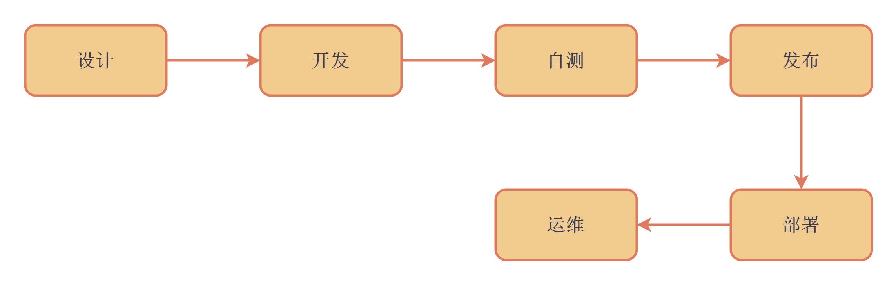
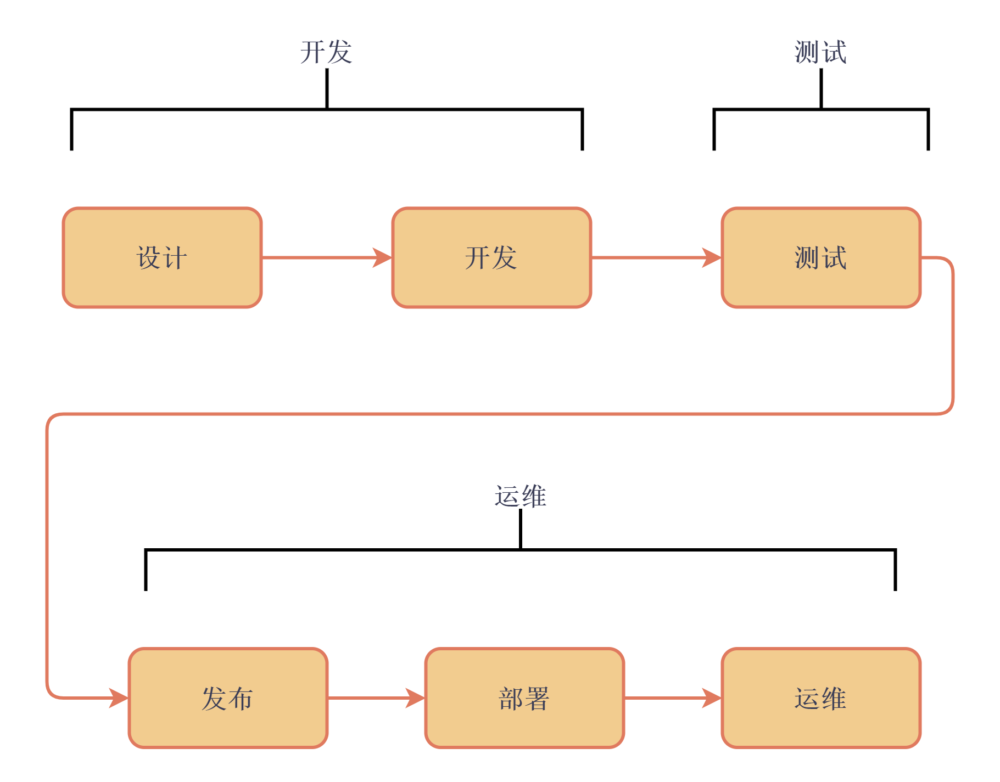
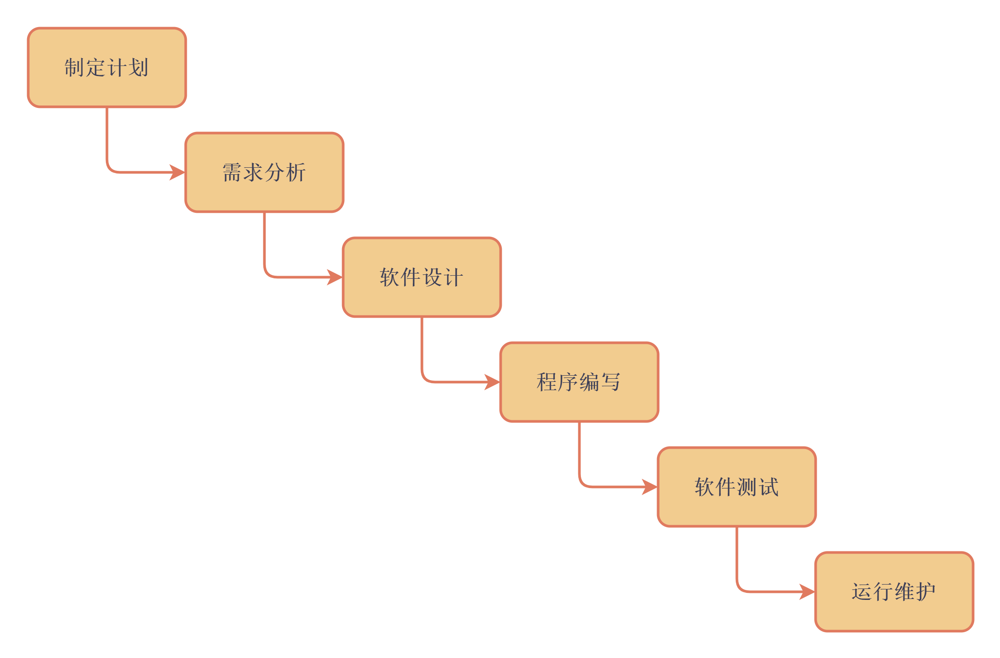
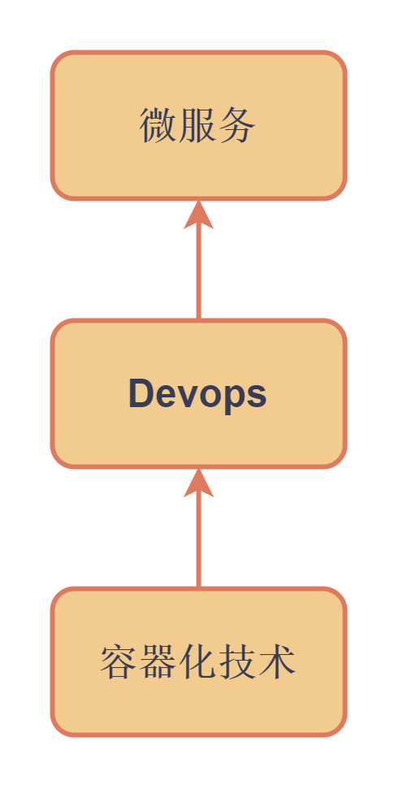

# Devops、持续集成与交付

## Devops的概念和发展

在计算机程序开发的早期， 程序都相对简单，一个人就可以完成从开发到上线的全部任务。所以早期的计算程序的全流程是这样的：设计—开发—自测—发布—部署—维护。如下所示：

随着程序功能的复杂化和规模的扩大，协作成为软件开发的必然趋势。由于开发团队的规模越来越大，测试工程师和运维工程师也逐渐分离出来作为单独的职能。在开发团队中，研发工程师从事代码设计和开发；测试工程师负责测试和维护程序的完善性；而运维工程师负责发布、部署和维护软件。

这种软件开发模式称为瀑布模型。这种软件开发模型将开发分为六个独立的阶段，每个阶段有明确的先后顺序，就像瀑布一样下降。但是这种模型是非常理想化的情况，实际的开发中情况将更为复杂。这也是敏捷开发出现的土壤。

瀑布模型过于理想化，因为该理论是基于软件的开发是单向迭代并且时间充足的假定前提。而敏捷开发更加贴近实际，背景是越发加快的软件开发节奏和软件迭代速度。这种模型将软件开发分割为多个很小的时间点或者里程碑，两个时间点间（称为增量）完成一次完整的瀑布开发周期。

敏捷开发有许多优点，产品可以以更快的速度迭代，开发团队对于用户反馈的响应更快。而且，由于敏捷开发每次需要执行测试的改动较小，从而程序出现大规模问题的风险相比常规的开发流程更小。

但敏捷开发同样带来了很多问题，首要的就是开发和运维之间的矛盾。一般地，运维希望版本足够稳定，避免频繁地发布与部署，但这和敏捷开发的特点相冲突。为了解决敏捷开发带来的问题，Devops应运而生。

Devops的目的是在保留敏捷开发的优点的前提下解决敏捷开发和稳定运维之间的矛盾。**DevOps是一组过程、方法与系统的统称，用于促进开发、技术运营和质量保障（QA）部门之间的沟通、协作与整合。**Devops贯穿了程序开发的全过程，有助于有效提升开发和运维人员在软件高速迭代的要求下的协作效率，从而使得开发过程更加快捷可靠。为了实现这个目标，Devops借助同时期兴起的Docker技术，引入了CI/CD概念。

CI/CD，即持续集成/持续交付，是Devops的一个重大成果，可以通过自动化程序在很少人工干预的情况下做到高速迭代、发布、集成，更频繁地向用户交付应用。

持续集成要求开发人员更频繁地以相对较小的里程碑向分支提交代码，一旦代码被合并到主分支，系统就会通过一系列的自动化测试（包括单元和集成测试）来检查更改，确保更改没有影响到应用程序的稳定性和健壮性。由于每次提交的更改较小，如果代码出现冲突，需要检查的代码也会变少，这样可以加快代码合并的效率，并且使得修复变得更加容易。同时，由于使用了自动化集成与测试，可以减少开发人员提交代码时的工作量，和测试人员对每个提交进行测试的工作量。

持续交付，或者称持续部署是每个开发小周期的最后阶段。作为持续交付和自动化发布的结果，持续交付可以自动化地将测试通过的程序部署到生产环境中。一般而言，良好的自动化程序设计可以使得开发在提交代码之后几分钟就在生产环境中生效。这样更有利于快速响应用户反馈的问题。但需要注意的是，由于从提交到部署中间一般并没有手动的审核，因此自动化测试和审核程序的设计就至关重要。

## 容器与 DevOps

容器的诞生给Devops注入了强劲动力。在介绍容器技术对于Devops的助理之前，先要谈谈什么是微服务。


DevOps与虚拟化、容器、微服务


在软件开发的早期，很多功能都在一个服务中，这种做法起初十分简便，但随着软件规模的持续扩大，维护和排错变成了十分困难的事情。这时软件开发者自然考虑将一个包含各种功能的大服务拆分为多个小型服务，每个小型服务提供一项功能，服务之间通过HTTP或者RPC调用。这样将大服务拆分为小服务，大大减小了排障的工作量，同时也不会出现一个服务宕机导致其他服务也不能运行的情况。同时，每个服务可以交由不同团队使用不同语言完成，工作效率大大提高。

但是微服务也会带来更多的协调和调试工作量。如果要高效地实现微服务的高速迭代，一体化的devops平台必不可少。在容器化技术以前，为了满足devops的要求，更多的工作聚焦于持续集成/交付技术，被称作devops1.0时代。随着容器化技术的诞生，devops进入了2.0时代。Devops的需求和docker技术的能力相当匹配：Docker提供了轻量化的运行环境，可以使得快速迭代的微服务得以同步高效部署；其次docker提供方便快速搭建标准化环境的能力，可以更好地让各种微服务在各自的标准环境中运行。同时Docker的隔离性可以更好的区分生产和开发环境，避免各种泄露问题。Docker满足了微服务对运行平台的需求，同时为devops提供良好的支撑。

Docker在devops的每个阶段都发挥作用。在开发阶段，可以快速在本地配置一个标准化的开发环境，使得不同开发人员的开发环境一致；在集成阶段，通过配置dockerfile可以将服务化，将dockerfile提交到仓库中，并且在集成中使用dockerfile构建镜像，这样可以显著提高集成速度；在部署阶段，由于业务镜像已经上传到镜像仓库中，仅需要从仓库中拉取即可在生产环境快速部署并且启动应用。此外，如果部署后观察到显著异常，可以很快地回滚到前一版本，避免出现大规模业务故障。

## 扩展阅读








