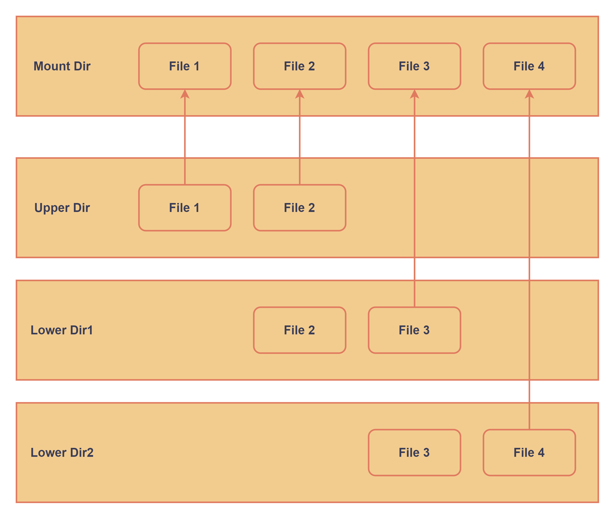

# 容器镜像与Dockerfile

## 镜像的存储驱动

之前提到了镜像是分层构建的，即在Base layer上一层层添加镜像，上层的镜像依赖于下层的镜像。这样可以避免大量的重复工作。本节将探究镜像构建和加载的底层机制，同时介绍几种常见的镜像组织形式。通过这一节，可以了解到一个重要问题：镜像为什么要分层，以及镜像如何做到分层的。

容器是通过在只读映像层上叠加一个可写的薄层来创建的。镜像层包含基本系统，例如多个容器常用的库和应用程序。因为它不能被容器修改，所以在使用镜像生成容器时，为每个容器准备了一个可写层，它包含容器在运行时创建的数据和日志文件以及安装的应用程序。这个可写层还可以包含基本映像中不包含的自定义库和应用程序。同时，如果将容器导出为镜像，可以将不同的可写层进一步堆叠在可写层和镜像层的堆栈之上。为了组织这样一种文件结构，并且保持镜像的轻量化的特点，目前Docker使用一种称为overlayFS的文件系统组织镜像内部的文件。

### OverlayFS

OverlayFS是一种Linux的联合挂载文件系统实现。和通常熟知的文件系统（比如exFAT等）不同，OverlayFS建立在其他的底层文件系统（例如ext4fs等）之上，不直接管理磁盘。OverlayFS的主要功能就是将用户指定的所有目录中的文件合并到同一层上向用户呈现。实际上，用户看到的目录下的文件可能来自于不同的路径。如图所示：



#### OverlayFS的功能

在Overlayfs中，只读层称为下层（lower layer），而可写的层称为上层（upper layer）。图中的upper die和lower dir均为用户指定的需要合并的目录，mount dir为文件系统的挂载点。在overlayFS挂载后，mount目录下可以看到来自这几个目录中的文件，而文件的来源对于用户而言是透明的，用户只会看到一个文件系统的根目录。

#### OverlayFS的读写

尽管都会被合并到mount dir中，upper layer和lower layer的优先级并不相同；简单而言，当出现冲突，即出现相同文件时，lower layer的文件将会被隐藏，用户只能看见来自upper layer的文件，例如上图中的file2；其次，lower layer之间也存在层次关系，较下层的冲突文件会被隐藏，如图中的file3。

之前提到upper layer是可写层，而lower layer是只读层。所以当用户通过挂载点mount dir向来自于upper layer的文件执行写入或删除操作时，修改会直接同步到upper layer中的文件；而对于来源于lower layer的文件，无论在overlayFS挂在后如何操作这些文件，都不会对lower layer中的原文件进行任何的修改。对应地，为了实现对这种文件进行操作的功能，第一次修改时overlayFS会将lower layer中的文件拷贝一份到可写层upper layer中，后续的修改将会在upper layer中的对应副本中进行，而原文件将会被隐藏。

overlayFS之所以被Docker采用作为基本的文件系统，就是基于其三大特点：上下层同名目录合并、上下层同名文件屏蔽、lower layer文件写拷贝。这三点都是对用户透明，用户并不会在使用中察觉到。

### OverlayFS在容器中的应用

在Docker容器中，镜像层（image layer）对应lower layer，是只读的；而容器层（container layer）对应upper layer。在容器创建成功后，文件系统即被挂载到挂载点，在容器层进行相关操作。早期版本的docker并不支持多个lower layer（但可以有多个lower dir），该功能是在Linux-4.0以后才得到完善的。

一般而言，容器在创建过程中，每一个镜像层对应一个lower dir，而将一个overlayFS的mount dir挂载到容器内部作为根目录。在早期的版本中，每一个lower dir以硬链接的方式链接到上一层，最终mount dir只挂载最上一层lower dir和upper dir。在使用了overlay2 driver之后，容器的挂载方式出现了改变。新的挂载方式基于新版本overlayFS的multiple lower layers特性，不需要逐个硬链接，而是直接将每个lower dir都连接到mount dir下。这样可以大大减少文件系统的复杂度，并且减少inode的开销。下面的对比图直观地显示了两种利用方式的不同。


尽管目前不同平台上最新版本的docker都默认使用overlayFS2文件驱动，但这种驱动并非没有缺点，并且同样提供多种其他的文件驱动替换。overlay在文件级别而不是块级别运行，这样可以更有效地使用内存，但在写入密集型工作负载中，容器的可写层可能会变得非常大。相比之下，操作磁盘块的文件系统，比如devicemapper、btrfs、zfs，将会有更好的性能表现，但btrfs和zfs会占用大量的内存。所以如果要对容器的文件性能有较高要求，针对业务特点选择合适的文件驱动是必要的。

## DockerFile：镜像的构建方式

上一章我们提到，镜像的构建是分层的。但一般实际应用中的镜像远不止几层，为了进一步减少工作量并且保证镜像的标准化生成和交付，DockerFile应运而生。DockerFile是构建标准镜像的脚本也是一个Docker镜像的描述文件，使用DockerFile是最基本的创建镜像的方式。文件的每一行构建一层镜像，就像一层层地盖房子一样。因此每一条指令的内容，就是描述该层应当如何构建。



.png>)

## DockerFile的构建实例

Dockerfile结构主要分为四个部分：

1. 基础镜像（Base layer）信息
2. 维护者信息
3. 镜像操作指令
4. 容器启动时执行指令。

Dockerfile每行支持一条指令，并且支持使用以#号开头的注释。下面的示例代码基于Centos，构建了一个带有httpd包的镜像。

```docker
#基于centos镜像
FROM centos

#维护人的信息
MAINTAINER AuthorName

#安装httpd软件包
RUN yum -y update
RUN yum -y install httpd

#开启80端口
EXPOSE 80

#复制网站首页文件至镜像中web站点下
ADD index.html /var/www/html/index.html

#复制该脚本至镜像根目录下，并修改其权限
ADD script.sh /script.sh
RUN chmod 775 /script.sh

#当启动容器时执行的脚本文件
CMD ["/script.sh"]
```

下面是一些构建DockerFile的常用命令：

* `FROM`：指名Base layer的镜像名称。
* `MAINTAINER`：维护人的信息。
* `RUN`：在镜像内安装新应用的指令。比如`yum install`,`apt get`等。
* `EXPOSE`：创建容器时暴露端口。
* `ADD`：向镜像内添加文件。
* `WORKDIR`：设置当前工作目录。
* `CMD`：启动容器时执行的Shell命令。注意这些命令会被`docker run`命令的参数覆盖。

## 扩展阅读






更多的指令说明

